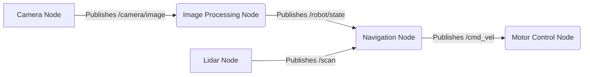
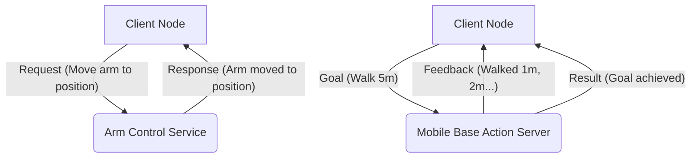

# Chapter 1: The Robotic Nervous System - ROS 2

## Decoding the Future of Humanoid Robotics

Welcome, future architects of physical intelligence! In this module, we embark on a crucial journey: understanding and mastering the Robotic Operating System 2 (ROS 2). Think of ROS 2 as the central nervous system for modern humanoid robots. Just as our brains coordinate complex movements, sensory input, and decision-making, ROS 2 provides the flexible, distributed framework that allows diverse robotic components - from high-level AI agents to low-level motor controllers - to communicate seamlessly.

In the rapidly evolving landscape of Physical AI and humanoid robotics, ROS 2 isn't just a tool; it's the lingua franca. By the end of this module, you'll not only grasp its core principles but also wield its power to bring your robotic creations to life.

<!-- Hero section with animated robot GIF placeholder -->


---

## Learning Outcomes

Upon completing this module, you will be able to:

*   Explain the architectural differences and advantages of ROS 2 over ROS 1, particularly for real-time and safety-critical applications.
*   Design and implement ROS 2 nodes, publishers, subscribers, services, and actions using `rclpy` (Python).
*   Integrate external Python-based AI agents (e.g., Large Language Models, Reinforcement Learning policies) with a ROS 2 system.
*   Create and visualize sophisticated humanoid robot models using URDF and Xacro in RViz2.
*   Debug common ROS 2 issues and apply best practices for robust robotic development.

---

## Why ROS 2 Matters in 2025-2030: Fueling the Humanoid Revolution

In the mid-2020s, the convergence of advanced AI, improved mechatronics, and breakthroughs in perception has ushered in an unprecedented era for humanoid robotics. From factory floors to assistive care, dexterous manipulation to complex human-robot interaction, humanoids are stepping out of labs and into the real world.

ROS 2 stands at the epicenter of this revolution for several critical reasons:

*   **Distributed Architecture**: Humanoid robots are inherently complex, with dozens of sensors, actuators, and compute units. ROS 2's DDS (Data Distribution Service) layer enables highly reliable, low-latency, and scalable communication across these disparate components, whether they're on a single robot or distributed across a fleet.
*   **Real-Time Capabilities**: Unlike its predecessor, ROS 2 was designed from the ground up with real-time performance in mind. This is paramount for humanoids, where precise, synchronized movements and rapid reaction times are not just desirable but safety-critical.
*   **Enterprise-Grade Security**: Security is no longer an afterthought. ROS 2 provides robust security features (authentication, encryption, access control) crucial for protecting humanoids operating in sensitive environments.
*   **Language Agnostic**: While `rclpy` (Python) is a favorite for AI researchers, `rclcpp` (C++) offers maximum performance. ROS 2's language-agnostic core allows diverse teams to contribute using their preferred tools.
*   **Industry Adoption**: Major players in robotics, research institutions, and startups have embraced ROS 2, creating a vibrant ecosystem of tools, libraries, and expertise. This community support accelerates development and problem-solving.

:::tip
**Key Takeaway**: ROS 2 isn't just a framework; it's an operating system designed for the complexities and demands of next-generation physical AI and humanoid robots. Its robust, real-time, and secure nature makes it indispensable.
:::

---

## Core Concepts Deep-Dive

At its heart, ROS 2 is about communication. Let's break down its fundamental building blocks.

### Nodes, Topics, Publishers/Subscribers

Imagine a robot's "brain" as a collection of independent programs, each focused on a specific task: one node processes camera data, another controls motors, another plans movements. These are **nodes**.

Nodes communicate by sending messages over named channels called **topics**. A node that sends messages to a topic is a **publisher**, and a node that receives messages from a topic is a **subscriber**. This asynchronous, decoupled communication pattern is incredibly powerful.


*Mermaid Diagram: Basic ROS 2 Topic Communication Flow*

### Services vs Actions

While topics are for continuous, asynchronous data streams (like sensor readings), **services** are used for synchronous, request-response communication. Think of it like a function call: a client node sends a request to a server node, and waits for a response. Services are typically for short, blocking operations.

**Actions**, on the other hand, are for long-running, goal-oriented tasks that provide continuous feedback. When an action client sends a goal to an action server, the server provides regular feedback on its progress and ultimately a result. This is ideal for tasks like "walk 5 meters forward" where you want to know if the robot is moving, how far it's gone, and if it reached the target.


*Mermaid Diagram: ROS 2 Services vs. Actions*

### ROS 2 DDS Layer Explained Simply

The magic behind ROS 2's robust communication is the Data Distribution Service (DDS). Instead of a central master (like ROS 1), DDS allows nodes to discover each other and communicate directly in a peer-to-peer fashion. This makes ROS 2 inherently more fault-tolerant, scalable, and suitable for real-time applications.

DDS handles data serialization, transport, and quality of service (QoS) policies (e.g., reliability, durability, latency). This means developers can focus on application logic, not networking complexities.

### Real-time & Safety-Critical Features (ROS 2 vs ROS 1)

ROS 1, while revolutionary, wasn't built for hard real-time guarantees or robust safety. ROS 2 addresses this with:

*   **Real-time Linux (RT-Preempt)**: Integration with RTOS allows for deterministic execution.
*   **Managed Executors**: Control how nodes execute, prioritizing critical paths.
*   **Quality of Service (QoS)**: Fine-grained control over message delivery, crucial for sensor fusion and control loops.
*   **Security (SROS 2)**: Authentication, authorization, and encryption for secure communication, vital for humanoids operating in shared spaces.

:::danger
**Warning**: While ROS 2 offers real-time capabilities, achieving true hard real-time performance often requires careful system design, specific hardware, and deep understanding of operating system scheduling.
:::

---

## Hands-on Section 1: Your First ROS 2 Humanoid Node

Let's get practical. We'll create a simple ROS 2 Python node that "thinks" about a humanoid robot's arm movement.

### Setup ROS 2 Workspace

First, set up a ROS 2 workspace. This example assumes Ubuntu 22.04 with ROS 2 Humble/Iron installed.

```bash
# Create a new ROS 2 workspace
mkdir -p ~/ros2_humanoid_ws/src
cd ~/ros2_humanoid_ws/src

# Create a new package for our humanoid arm controller
ros2 pkg create --build-type ament_python humanoid_arm_controller

# Navigate to the package directory
cd humanoid_arm_controller
```

### Writing the "Thinker" Node

Now, let's create a Python node that acts as a simple AI agent, deciding on an arm pose and publishing it.

```python
# physical-ai-humanoid-robotics-textbook/ros2_humanoid_ws/src/humanoid_arm_controller/humanoid_arm_controller/arm_thinker.py
import rclpy
from rclpy.node import Node
from std_msgs.msg import String # We'll publish a simple string message for now
import random

class ArmThinker(Node):
    def __init__(self):
        super().__init__('arm_thinker') # Initialize the node with a name
        self.publisher_ = self.create_publisher(String, 'arm_pose_command', 10) # Create a publisher for 'arm_pose_command' topic
        timer_period = 2  # seconds
        self.timer = self.create_timer(timer_period, self.timer_callback)
        self.get_logger().info('Arm Thinker Node has started. Publishing arm pose commands...')

    def timer_callback(self):
        possible_poses = ["wave", "reach_forward", "rest", "grab"]
        chosen_pose = random.choice(possible_poses)
        msg = String()
        msg.data = f'Command: {chosen_pose}' # AI agent "decides" on a pose
        self.publisher_.publish(msg)
        self.get_logger().info(f'Published: "{msg.data}"')

def main(args=None):
    rclpy.init(args=args) # Initialize rclpy library
    arm_thinker = ArmThinker() # Create the node
    rclpy.spin(arm_thinker) # Keep the node alive
    arm_thinker.destroy_node() # Destroy the node when done
    rclpy.shutdown() # Shutdown rclpy library

if __name__ == '__main__':
    main()
```
*Code Block: `arm_thinker.py` - A simple ROS 2 Python node simulating AI arm pose decisions.*

### Update `setup.py`

You need to tell ROS 2 how to find and run your Python script. Edit `setup.py` in your package:

```python
# physical-ai-humanoid-robotics-textbook/ros2_humanoid_ws/src/humanoid_arm_controller/setup.py
from setuptools import find_packages, setup

package_name = 'humanoid_arm_controller'

setup(
    name=package_name,
    version='0.0.0',
    packages=find_packages(exclude=['test']),
    data_files=[
        ('share/' + package_name, ['package.xml']),
        ('share/' + package_name + '/launch', ['launch/arm_controller.launch.py']), # Add this line for launch files later
    ],
    install_requires=['setuptools'],
    zip_safe=True,
    maintainer='your_name',
    maintainer_email='your_email@example.com',
    description='TODO: Package description',
    license='TODO: License declaration',
    tests_require=['pytest'],
    entry_points={
        'console_scripts': [
            'arm_thinker = humanoid_arm_controller.arm_thinker:main', # Add this line to make your script runnable
        ],
    },
)
```
*Code Block: `setup.py` - Configuring ROS 2 to run your Python node.*

### Building and Running

Now, build your workspace and run the node:

```bash
# Navigate back to the workspace root
cd ~/ros2_humanoid_ws

# Build the package
colcon build

# Source the setup files to make your new package available
source install/setup.bash

# Run your arm_thinker node
ros2 run humanoid_arm_controller arm_thinker
```

:::info
**Expected Terminal Output:**

```
[INFO] [arm_thinker]: Arm Thinker Node has started. Publishing arm pose commands...
[INFO] [arm_thinker]: Published: "Command: wave"
[INFO] [arm_thinker]: Published: "Command: rest"
[INFO] [arm_thinker]: Published: "Command: reach_forward"
... (output will continue every 2 seconds with random poses)
```
:::

To inspect the topic:

```bash
# In a new terminal, source ROS 2 setup
source ~/ros2_humanoid_ws/install/setup.bash

# List active topics
ros2 topic list

# See the messages being published
ros2 topic echo /arm_pose_command
```

:::info
**Expected Terminal Output (ros2 topic list):**

```
/arm_pose_command
/parameter_events
/rosout
```

**Expected Terminal Output (ros2 topic echo /arm_pose_command):**

```
data: Command: wave
---
data: Command: rest
---
data: Command: grab
---
...
```
:::

---

## Hands-on Section 2: Bridging Python AI Agents - ROS 2 using `rclpy`

This is where Physical AI truly shines. Imagine a sophisticated LLM (Large Language Model) that "understands" a high-level command like "navigate to the kitchen." The LLM, acting as a high-level AI agent, needs to translate this into low-level robot commands. `rclpy` provides the perfect bridge.

Let's expand our example: An LLM (simulated here) decides the robot should "walk forward." We'll publish a `geometry_msgs/Twist` message, which is a standard ROS 2 message for commanding robot velocity.

```python
# physical-ai-humanoid-robotics-textbook/ros2_humanoid_ws/src/humanoid_arm_controller/humanoid_arm_controller/llm_agent_bridge.py
import rclpy
from rclpy.node import Node
from geometry_msgs.msg import Twist # Standard message for velocity commands
from std_msgs.msg import String # For receiving high-level LLM commands
import time

class LLMAgentBridge(Node):
    def __init__(self):
        super().__init__('llm_agent_bridge')
        self.velocity_publisher = self.create_publisher(Twist, 'cmd_vel', 10) # Publisher for robot velocity
        self.llm_command_subscriber = self.create_subscription(
            String,
            'llm_high_level_command', # Topic where our simulated LLM will publish
            self.llm_command_callback,
            10
        )
        self.get_logger().info('LLM Agent Bridge Node has started. Waiting for high-level commands...')

    def llm_command_callback(self, msg):
        self.get_logger().info(f'Received LLM Command: "{msg.data}"')

        # --- Physical AI Relevance: Translate high-level intent to robot action ---
        if "walk forward" in msg.data.lower():
            self.publish_twist_command(linear_x=0.2, angular_z=0.0) # Move forward at 0.2 m/s
            self.get_logger().info('Translated to: Walking forward...')
            time.sleep(2) # Simulate duration of command
            self.publish_twist_command(linear_x=0.0, angular_z=0.0) # Stop
            self.get_logger().info('Stopped.')
        elif "turn left" in msg.data.lower():
            self.publish_twist_command(linear_x=0.0, angular_z=0.5) # Turn left
            self.get_logger().info('Translated to: Turning left...')
            time.sleep(1) # Simulate duration of command
            self.publish_twist_command(linear_x=0.0, angular_z=0.0) # Stop
            self.get_logger().info('Stopped.')
        else:
            self.get_logger().warn('Unknown LLM command, taking no action.')

    def publish_twist_command(self, linear_x, angular_z):
        twist_msg = Twist()
        twist_msg.linear.x = float(linear_x)
        twist_msg.angular.z = float(angular_z)
        self.velocity_publisher.publish(twist_msg)

def main(args=None):
    rclpy.init(args=args)
    llm_agent_bridge = LLMAgentBridge()
    rclpy.spin(llm_agent_bridge)
    llm_agent_bridge.destroy_node()
    rclpy.shutdown()

if __name__ == '__main__':
    main()
```
*Code Block: `llm_agent_bridge.py` - Bridging a simulated LLM command to ROS 2 velocity commands.*

### Update `setup.py` and Run

Add the new `llm_agent_bridge` to `setup.py`:

```python
# physical-ai-humanoid-robotics-textbook/ros2_humanoid_ws/src/humanoid_arm_controller/setup.py (excerpt)
    entry_points={
        'console_scripts': [
            'arm_thinker = humanoid_arm_controller.arm_thinker:main',
            'llm_agent_bridge = humanoid_arm_controller.llm_agent_bridge:main', # Add this line
        ],
    },
)
```
*Code Block: `setup.py` - Adding the LLM agent bridge node.*

Build and run:

```bash
# Navigate back to the workspace root
cd ~/ros2_humanoid_ws

# Build the package (again)
colcon build

# Source the setup files
source install/setup.bash

# Run the LLM agent bridge node
ros2 run humanoid_arm_controller llm_agent_bridge
```

In a new terminal, simulate the LLM sending a command:

```bash
# Source ROS 2 setup
source ~/ros2_humanoid_ws/install/setup.bash

# Publish a high-level command
ros2 topic pub /llm_high_level_command std_msgs/String "data: 'Please walk forward'" -1
```

:::info
**Expected Terminal Output (LLM Agent Bridge terminal):**

```
[INFO] [llm_agent_bridge]: LLM Agent Bridge Node has started. Waiting for high-level commands...
[INFO] [llm_agent_bridge]: Received LLM Command: "Please walk forward"
[INFO] [llm_agent_bridge]: Translated to: Walking forward...
[INFO] [llm_agent_bridge]: Stopped.
```

**Expected Terminal Output (new terminal, checking velocity command):**

```bash
ros2 topic echo /cmd_vel
```

```
linear:
  x: 0.2
  y: 0.0
  z: 0.0
angular:
  x: 0.0
  y: 0.0
  z: 0.0
---
linear:
  x: 0.0
  y: 0.0
  z: 0.0
angular:
  x: 0.0
  y: 0.0
  z: 0.0
```
*(You will see the 0.2 m/s forward command followed by 0.0 m/s after 2 seconds)*
:::

---

## URDF & Xacro Mastery for Humanoids

Unified Robot Description Format (URDF) and its extension, Xacro, are fundamental for defining the kinematic and dynamic properties of your humanoid robots within ROS 2. URDF uses XML to describe links (rigid bodies) and joints (connections between links). Xacro, XML Macros, makes URDF more modular and readable.

### Simple 12-DoF Humanoid URDF Example

Let's create a simplified URDF for a humanoid. This will define a base, torso, two arms (each with shoulder, elbow, wrist), and two legs (hip, knee, ankle).

```xml
<!-- physical-ai-humanoid-robotics-textbook/ros2_humanoid_ws/src/humanoid_arm_controller/urdf/simple_humanoid.urdf.xacro -->
<?xml version="1.0"?>
<robot xmlns:xacro="http://www.ros.org/wiki/xacro" name="simple_humanoid">

  <!-- Define common properties -->
  <xacro:property name="M_PI" value="3.1415926535897931" />

  <xacro:macro name="default_inertial" params="mass">
    <inertial>
      <mass value="${mass}" />
      <inertia ixx="0.001" ixy="0.0" ixz="0.0" iyy="0.001" iyz="0.0" izz="0.001" />
    </inertial>
  </xacro:macro>

  <!-- Base Link -->
  <link name="base_link">
    <visual>
      <geometry><box size="0.2 0.2 0.4"/></geometry>
      <material name="blue"><color rgba="0 0 1 1"/></material>
    </visual>
    <collision>
      <geometry><box size="0.2 0.2 0.4"/></geometry>
    </collision>
    <xacro:default_inertial mass="5.0"/>
  </link>

  <!-- Torso Link -->
  <joint name="torso_joint" type="fixed">
    <parent link="base_link"/>
    <child link="torso_link"/>
    <origin xyz="0 0 0.2" rpy="0 0 0"/>
  </joint>
  <link name="torso_link">
    <visual>
      <geometry><box size="0.3 0.2 0.3"/></geometry>
      <material name="red"><color rgba="1 0 0 1"/></material>
    </visual>
    <collision>
      <geometry><box size="0.3 0.2 0.3"/></geometry>
    </collision>
    <xacro:default_inertial mass="10.0"/>
  </link>

  <!-- --- Right Arm --- -->
  <xacro:macro name="arm_segment" params="prefix parent_link origin_xyz">
    <joint name="${prefix}_shoulder_joint" type="revolute">
      <parent link="${parent_link}"/>
      <child link="${prefix}_shoulder_link"/>
      <origin xyz="${origin_xyz}" rpy="0 0 0"/>
      <axis xyz="0 1 0"/>
      <limit lower="-${M_PI/2}" upper="${M_PI/2}" effort="100" velocity="1.0"/>
    </joint>
    <link name="${prefix}_shoulder_link">
      <visual>
        <geometry><cylinder radius="0.05" length="0.2"/></geometry>
        <material name="green"><color rgba="0 1 0 1"/></material>
      </visual>
      <collision>
        <geometry><cylinder radius="0.05" length="0.2"/></geometry>
      </collision>
      <xacro:default_inertial mass="1.0"/>
    </link>

    <joint name="${prefix}_elbow_joint" type="revolute">
      <parent link="${prefix}_shoulder_link"/>
      <child link="${prefix}_elbow_link"/>
      <origin xyz="0 0 -0.1" rpy="0 0 0"/>
      <axis xyz="0 1 0"/>
      <limit lower="0" upper="${M_PI}" effort="100" velocity="1.0"/>
    </joint>
    <link name="${prefix}_elbow_link">
      <visual>
        <geometry><cylinder radius="0.04" length="0.2"/></geometry>
        <material name="yellow"><color rgba="1 1 0 1"/></material>
      </visual>
      <collision>
        <geometry><cylinder radius="0.04" length="0.2"/></geometry>
      </collision>
      <xacro:default_inertial mass="0.8"/>
    </link>

    <joint name="${prefix}_wrist_joint" type="revolute">
      <parent link="${prefix}_elbow_link"/>
      <child link="${prefix}_hand_link"/>
      <origin xyz="0 0 -0.1" rpy="0 0 0"/>
      <axis xyz="0 1 0"/>
      <limit lower="-${M_PI/4}" upper="${M_PI/4}" effort="100" velocity="1.0"/>
    </joint>
    <link name="${prefix}_hand_link">
      <visual>
        <geometry><box size="0.08 0.08 0.05"/></geometry>
        <material name="white"><color rgba="1 1 1 1"/></color>
      </visual>
      <collision>
        <geometry><box size="0.08 0.08 0.05"/></geometry>
      </collision>
      <xacro:default_inertial mass="0.3"/>
    </link>
  </xacro:macro>

  <xacro:arm_segment prefix="right" parent_link="torso_link" origin_xyz="0 -0.15 -0.1"/>
  <xacro:arm_segment prefix="left" parent_link="torso_link" origin_xyz="0 0.15 -0.1"/>

  <!-- --- Legs (simplified for 2 DoF each) --- -->
  <xacro:macro name="leg_segment" params="prefix parent_link origin_xyz">
    <joint name="${prefix}_hip_joint" type="revolute">
      <parent link="${parent_link}"/>
      <child link="${prefix}_hip_link"/>
      <origin xyz="${origin_xyz}" rpy="0 0 0"/>
      <axis xyz="0 1 0"/>
      <limit lower="-${M_PI/4}" upper="${M_PI/4}" effort="100" velocity="1.0"/>
    </joint>
    <link name="${prefix}_hip_link">
      <visual>
        <geometry><cylinder radius="0.07" length="0.15"/></geometry>
        <material name="orange"><color rgba="1 0.5 0 1"/></material>
      </visual>
      <collision>
        <geometry><cylinder radius="0.07" length="0.15"/></geometry>
      </collision>
      <xacro:default_inertial mass="3.0"/>
    </link>

    <joint name="${prefix}_knee_joint" type="revolute">
      <parent link="${prefix}_hip_link"/>
      <child link="${prefix}_knee_link"/>
      <origin xyz="0 0 -0.15" rpy="0 0 0"/>
      <axis xyz="0 1 0"/>
      <limit lower="0" upper="${M_PI/2}" effort="100" velocity="1.0"/>
    </joint>
    <link name="${prefix}_knee_link">
      <visual>
        <geometry><cylinder radius="0.06" length="0.15"/></geometry>
        <material name="purple"><color rgba="0.5 0 0.5 1"/></material>
      </visual>
      <collision>
        <geometry><cylinder radius="0.06" length="0.15"/></geometry>
      </collision>
      <xacro:default_inertial mass="2.5"/>
    </link>
  </xacro:macro>

  <xacro:leg_segment prefix="right_leg" parent_link="base_link" origin_xyz="0 -0.075 -0.3"/>
  <xacro:leg_segment prefix="left_leg" parent_link="base_link" origin_xyz="0 0.075 -0.3"/>

</robot>
```
*Code Block: `simple_humanoid.urdf.xacro` - A 12-DoF humanoid robot model using Xacro macros.*

### Visualization in RViz2

To visualize your URDF, you'll need to install `ros2_urdf_tutorial` and run `rviz2`.

```bash
# Navigate to your workspace src
cd ~/ros2_humanoid_ws/src

# If you don't have it, clone the urdf_tutorial for its launch files
# git clone https://github.com/ros/urdf_tutorial.git

# Navigate to your package
cd ~/ros2_humanoid_ws/src/humanoid_arm_controller

# Create a launch directory and a simple launch file
mkdir launch
```

Create `arm_controller.launch.py` inside the `launch` directory:

```python
# physical-ai-humanoid-robotics-textbook/ros2_humanoid_ws/src/humanoid_arm_controller/launch/display.launch.py
import os
from ament_index_python.packages import get_package_share_directory
from launch import LaunchDescription
from launch.actions import DeclareLaunchArgument
from launch.substitutions import LaunchConfiguration, Command
from launch_ros.actions import Node

def generate_launch_description():
    # Get URDF path
    pkg_path = get_package_share_directory('humanoid_arm_controller')
    urdf_path = os.path.join(pkg_path, 'urdf', 'simple_humanoid.urdf.xacro')

    # RViz config path
    rviz_config_path = os.path.join(pkg_path, 'rviz', 'urdf.rviz') # Placeholder for now

    # Robot State Publisher node
    robot_state_publisher_node = Node(
        package='robot_state_publisher',
        executable='robot_state_publisher',
        parameters=[{'robot_description': Command(['xacro ', urdf_path])}]
    )

    # Joint State Publisher GUI node
    joint_state_publisher_gui_node = Node(
        package='joint_state_publisher_gui',
        executable='joint_state_publisher_gui',
        name='joint_state_publisher_gui',
        condition=LaunchConfiguration('gui')
    )

    # RViz node
    rviz_node = Node(
        package='rviz2',
        executable='rviz2',
        name='rviz2',
        output='screen',
        arguments=['-d', rviz_config_path], # Will fail if file doesn't exist, we will create it.
    )

    return LaunchDescription([
        DeclareLaunchArgument(
            name='gui',
            default_value='true',
            choices=['true', 'false'],
            description='Flag to enable joint_state_publisher_gui'
        ),
        robot_state_publisher_node,
        joint_state_publisher_gui_node,
        rviz_node
    ])
```
*Code Block: `display.launch.py` - Launch file to display URDF in RViz2.*

We need a dummy `rviz` directory and `urdf.rviz` file for the launch file not to error out.

```bash
# Navigate to your package
cd ~/ros2_humanoid_ws/src/humanoid_arm_controller

# Create rviz directory
mkdir rviz

# Create dummy rviz config file
touch rviz/urdf.rviz
```

Now, build and run the launch file:

```bash
# Navigate back to the workspace root
cd ~/ros2_humanoid_ws

# Build the package
colcon build

# Source the setup files
source install/setup.bash

# Launch RViz2 with your humanoid model
ros2 launch humanoid_arm_controller display.launch.py gui:=true
```

:::info
**Expected RViz2 Output:**

You should see a visual representation of your `simple_humanoid` robot in RViz2. Use the `joint_state_publisher_gui` sliders to manipulate the joints and see your humanoid move.

<!-- Placeholder for RViz2 screenshot -->


*Screenshot: Your 12-DoF humanoid robot visualized in RViz2, with joint sliders.*
:::

---

## Common Pitfalls & Debugging Tips

*   **`source install/setup.bash`**: Always remember to source your workspace setup files after building or opening a new terminal. This is the most common beginner mistake.
*   **Missing Dependencies**: Ensure all ROS 2 packages are installed. `rosdep install --from-paths src --ignore-src -r -y` helps resolve system dependencies.
*   **Node/Topic Names**: Use `ros2 node list` and `ros2 topic list` to verify your nodes and topics are running as expected. Typos are common!
*   **Message Types**: Double-check that publishers and subscribers are using the exact same message type. `ros2 interface show <msg_type>` is your friend.
*   **URDF Validation**: Use `check_urdf <your_robot.urdf>` to validate your URDF XML structure. `xacro <your_robot.urdf.xacro>` can expand Xacro files to plain URDF for debugging.

:::success
**Tip**: When debugging communication issues, `rqt_graph` is an invaluable graphical tool to visualize your ROS 2 computation graph (nodes and topics).
:::

---

## Quiz: Test Your Robotic Nervous System Knowledge!

Test your understanding of ROS 2 core concepts and practical implementation.

1.  **Multiple Choice**: Which of the following is *not* a primary advantage of ROS 2's DDS layer over ROS 1's central master architecture?
    a) Improved fault tolerance
    b) Enhanced real-time capabilities
    c) Simplified network configuration for large-scale deployments
    d) Guaranteed single point of failure
    <details>
      <summary>Answer</summary>
      **d) Guaranteed single point of failure** (DDS *removes* the single point of failure)
    </details>

2.  **Code Completion**: Fill in the blanks to correctly create a ROS 2 publisher for a `String` message on the topic `/robot_status`.

    ```python
    import rclpy
    from rclpy.node import Node
    from std_msgs.msg import String

    class StatusPublisher(Node):
        def __init__(self):
            super().__init__('status_node')
            self.publisher_ = self.______(String, '/robot_status', 10)
    ```
    <details>
      <summary>Answer</summary>
      `create_publisher`
    </details>

3.  **Multiple Choice**: For a long-running robotic task like "open the door," which ROS 2 communication primitive is most appropriate for providing continuous feedback and a final result?
    a) Topic
    b) Service
    c) Action
    d) Parameter
    <details>
      <summary>Answer</summary>
      **c) Action**
    </details>

4.  **Code Completion**: Complete the `entry_points` in `setup.py` to make `my_robot_controller.py` runnable as `robot_controller` from the command line.

    ```python
    # ...
    entry_points={
        'console_scripts': [
            'robot_controller = my_package._____:main',
        ],
    },
    # ...
    ```
    <details>
      <summary>Answer</summary>
      `my_robot_controller`
    </details>

5.  **Multiple Choice**: What is the primary purpose of Xacro in the context of URDF?
    a) To define real-time constraints for robot joints
    b) To enable secure communication between ROS 2 nodes
    c) To add modularity and reduce redundancy in URDF files
    d) To visualize robot models in 3D environments
    <details>
      <summary>Answer</summary>
      **c) To add modularity and reduce redundancy in URDF files**
    </details>

---

## Further Reading & Official Resources (2025 Links)

*   **Official ROS 2 Documentation**: The definitive source for all things ROS 2. ([https://docs.ros.org/en/humble/](https://docs.ros.org/en/humble/) or newer distribution if available)
*   **ROS 2 Design Articles**: Dive deeper into the architectural decisions behind ROS 2. ([https://design.ros2.org/](https://design.ros2.org/))
*   **rclpy Documentation**: Specifics for Python development in ROS 2. ([https://docs.ros.org/en/humble/p/rclpy/](https://docs.ros.org/en/humble/p/rclpy/) or newer)
*   **URDF/Xacro Tutorials**: Comprehensive guides on robot modeling. ([https://wiki.ros.org/urdf/Tutorials](https://wiki.ros.org/urdf/Tutorials) and search for ROS 2 specific versions)
*   **DDS for Robotics**: Understanding the underlying communication fabric. ([https://www.omg.org/dds/](https://www.omg.org/dds/))

---

## Summary and Transition to Module 2

In this foundational module, you've journeyed through the core of ROS 2, understanding its architectural prowess, mastering its communication primitives (nodes, topics, services, actions), and even bridging AI agents to control robot behaviors. You've also gained hands-on experience in defining humanoid robot structures using URDF and Xacro, visualizing them in RViz2.

The ability to command and coordinate physical robots is central to Physical AI. With ROS 2 as your robotic nervous system, you're now equipped to orchestrate complex behaviors.

But what if we could give our robots a playground where they can learn, fail, and adapt without the constraints of the physical world? What if we could build and test entire fleets of humanoids in a scalable, safe environment?

Ready for the Digital Twin? In Module 2, we will dive into the immersive world of simulation, where your physical AI agents will train and evolve in a virtual replica of reality. We'll explore Gazebo and Unity, building a robust digital proving ground for your humanoid creations.
