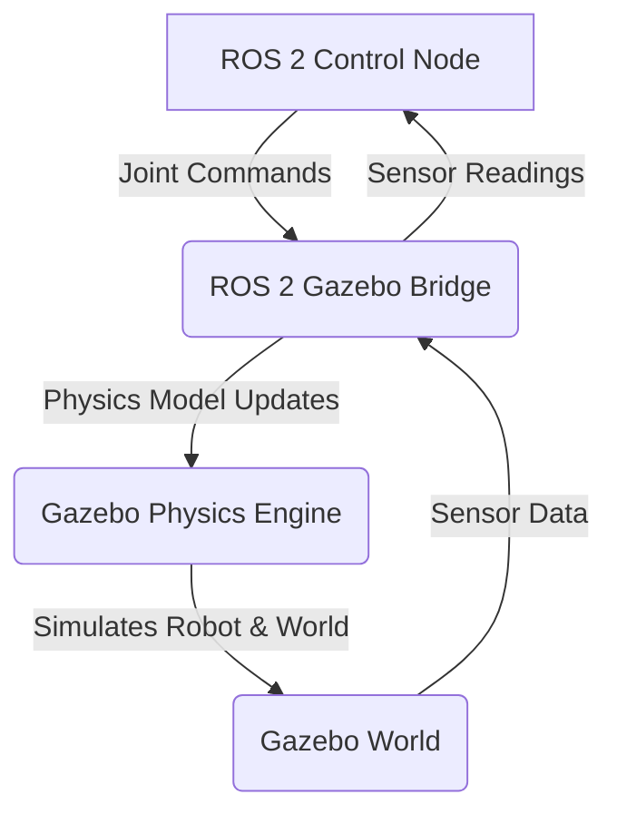
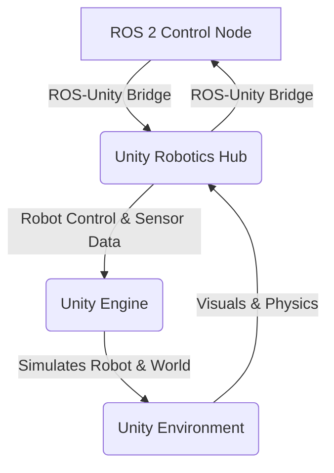

# Chapter 2: The Digital Twin   Simulating Humanoid Robotics

## Unleashing AI in Virtual Worlds

Welcome back, pioneers of Physical AI! In Module 1, we delved into the Robotic Operating System 2, the nervous system that brings our humanoid robots to life. Now, imagine giving those intelligent creations a boundless playground a place where they can learn, fail, and adapt without the constraints, costs, or risks of the physical world. This is the realm of **The Digital Twin**, and in this module, we will unlock its power through two industry-leading simulators: **Gazebo** and **Unity**.

Simulation is not just a debugging tool; it's a foundational pillar of modern robotics development, especially for complex humanoids. It allows for rapid iteration, safe experimentation with risky behaviors, large-scale data generation for AI training, and cost-effective development cycles. Prepare to build your virtual proving grounds where your physical AI agents will train and evolve.

<!-- Hero section with animated robot GIF placeholder -->


---

## Learning Outcomes

Upon completing this module, you will be able to:

*   Articulate the strategic importance of high-fidelity simulation for Physical AI and humanoid robotics.
*   Set up and configure ROS 2-integrated Gazebo worlds with custom robot models.
*   Utilize Unity to create visually rich robotic environments and integrate with ROS 2 via Unity Robotics Hub.
*   Deploy and test ROS 2 controllers (developed in Module 1) within both Gazebo and Unity simulation.
*   Understand the trade-offs between physics-centric (Gazebo) and graphics-centric (Unity) simulators.

---

## Why Simulation Matters for Physical AI

In the journey of developing intelligent humanoid robots, physical hardware is expensive, fragile, and often presents safety concerns during early development or aggressive AI training. This is where simulation becomes indispensable:

*   **Safe Experimentation**: Test failure modes, extreme conditions, and complex interactions without risking damage to robots or harm to humans.
*   **Rapid Prototyping & Iteration**: Design, implement, and test new algorithms, hardware designs (via URDF/SDF), and control strategies much faster than with physical systems.
*   **Data Generation for AI**: Train reinforcement learning (RL) agents or generate vast datasets for supervised learning (e.g., synthetic camera data, depth maps) at scale.
*   **Cost-Effectiveness**: Reduce reliance on expensive physical hardware, making robotics development accessible to a wider range of researchers and developers.
*   **Reproducibility & Debugging**: Isolate issues, revert to previous states, and ensure consistent testing environments, which is challenging with physical robots.

:::tip
**Key Concept**: The "Digital Twin" in robotics refers to a virtual replica of a physical system. It allows for advanced analysis, monitoring, and simulation, bridging the gap between the physical and digital worlds.
:::

---

## Core Concepts Deep-Dive: Gazebo and Unity

Choosing the right simulation platform depends on your primary goals. Gazebo excels in physics accuracy, while Unity offers unparalleled visual fidelity and a powerful game engine ecosystem.

### Gazebo: The Robotics Standard

Gazebo is an open-source 3D robot simulator that is tightly integrated with ROS 2. It offers:

*   **Robust Physics Engine**: Simulates realistic rigid-body dynamics, gravity, friction, and collisions.
*   **Sensor Simulation**: Realistic simulation of common robot sensors like cameras, LiDAR, IMUs, and force/torque sensors.
*   **ROS 2 Integration**: Native support for ROS 2 messages, services, and actions, allowing seamless communication between your robot code and the simulated environment.
*   **SDF (Simulation Description Format)**: Gazebo uses SDF (an extension of URDF) to describe entire worlds, including robots, environments, and sensors.


*Mermaid Diagram: ROS 2 - Gazebo Interaction Architecture*

### Unity: High Fidelity for AI and HRI

Unity, a powerful real-time 3D development platform, has gained significant traction in robotics for its:

*   **High-Fidelity Rendering**: Create stunningly realistic environments and visual simulations, crucial for computer vision tasks and human-robot interaction (HRI) studies.
*   **Extensive Asset Store**: Access a vast library of 3D models, environments, and tools.
*   **Reinforcement Learning (ML-Agents)**: Unity's ML-Agents Toolkit provides a seamless way to train RL agents directly within the Unity environment.
*   **Unity Robotics Hub**: A collection of ROS 2 packages and tools to integrate Unity with ROS 2, enabling control of simulated robots and streaming sensor data.


*Mermaid Diagram: ROS 2 - Unity Interaction Architecture*

---

## Hands-on Section 1: Your First Humanoid in Gazebo

Let's bring our simple humanoid from Module 1 into a Gazebo world.

### Create a Gazebo World

We'll start with a basic `empty.world` file and then add our robot.

```xml
<!-- physical-ai-humanoid-robotics-textbook/ros2_humanoid_ws/src/humanoid_arm_controller/worlds/simple_humanoid_world.world -->
<?xml version="1.0" ?>
<sdf version="1.6">
  <world name="simple_humanoid_world">
    <include>
      <uri>model://sun</uri>
    </include>
    <include>
      <uri>model://ground_plane</uri>
    </include>

    <!-- Placeholder for robot model -->
    <!-- Our simple_humanoid.urdf.xacro will be spawned here via launch file -->

  </world>
</sdf>
```
*Code Block: `simple_humanoid_world.world` - A basic Gazebo world file.*

### Update Launch File for Gazebo Integration

We need to modify our `display.launch.py` to launch Gazebo and spawn our robot.

```python
# physical-ai-humanoid-robotics-textbook/ros2_humanoid_ws/src/humanoid_arm_controller/launch/display_in_gazebo.launch.py
import os
from ament_index_python.packages import get_package_share_directory
from launch import LaunchDescription
from launch.actions import IncludeLaunchDescription, DeclareLaunchArgument
from launch.launch_description_sources import PythonLaunchDescriptionSource
from launch.substitutions import LaunchConfiguration, Command
from launch_ros.actions import Node

def generate_launch_description():
    # Get package directory
    pkg_path = get_package_share_directory('humanoid_arm_controller')

    # URDF/Xacro path
    urdf_path = os.path.join(pkg_path, 'urdf', 'simple_humanoid.urdf.xacro')

    # Gazebo launch file
    gazebo_ros_dir = get_package_share_directory('gazebo_ros')
    gazebo_launch_path = os.path.join(gazebo_ros_dir, 'launch', 'gazebo.launch.py')

    # World file path
    world_path = os.path.join(pkg_path, 'worlds', 'simple_humanoid_world.world')

    # Robot State Publisher node
    robot_state_publisher_node = Node(
        package='robot_state_publisher',
        executable='robot_state_publisher',
        parameters=[{'robot_description': Command(['xacro ', urdf_path])}]
    )

    # Spawn entity in Gazebo
    spawn_entity_node = Node(
        package='gazebo_ros',
        executable='spawn_entity.py',
        arguments=['-entity', 'simple_humanoid',
                   '-topic', 'robot_description'],
        output='screen'
    )

    return LaunchDescription([
        # Launch Gazebo itself
        IncludeLaunchDescription(
            PythonLaunchDescriptionSource(gazebo_launch_path),
            launch_arguments={'world': world_path}.items()
        ),
        robot_state_publisher_node,
        spawn_entity_node,
    ])
```
*Code Block: `display_in_gazebo.launch.py` - Launch file to spawn URDF in Gazebo.*

### Create `worlds` directory

```bash
# Navigate to your package
cd ~/ros2_humanoid_ws/src/humanoid_arm_controller

mkdir worlds
```

Build and run:

```bash
# Navigate back to the workspace root
cd ~/ros2_humanoid_ws

# Build the package
colcon build

# Source the setup files
source install/setup.bash

# Launch your humanoid in Gazebo
ros2 launch humanoid_arm_controller display_in_gazebo.launch.py
```

:::info
**Expected Gazebo Output:**

You should see the Gazebo simulator window open with your `simple_humanoid` robot resting on the ground plane. You can interact with it using Gazebo's controls.

<!-- Placeholder for Gazebo screenshot -->


*Screenshot: Your 12-DoF humanoid robot simulated in Gazebo.*
:::

---

## Hands-on Section 2: Unity Environment Setup & ROS 2 Bridge

Creating a Unity environment requires more graphical setup within the Unity Editor. We'll focus on establishing the ROS 2 communication bridge.

### Unity Robotics Hub Setup

1.  **Install Unity Hub & Editor**: Download and install Unity Hub, then a Unity Editor version (e.g., 2022.3 LTS) compatible with Unity Robotics Hub.
2.  **Create New Project**: Open Unity Hub, create a new 3D URP (Universal Render Pipeline) project.
3.  **Import Robotics-ROS2-Unity Package**: Use Unity's Package Manager (Window > Package Manager) to add the `Unity.Robotics.ROS2` package from Git URL. ([https://github.com/Unity-Technologies/Unity-Robotics-Hub/blob/main/tutorials/ros2_unity_integration/README.md](https://github.com/Unity-Technologies/Unity-Robotics-Hub/blob/main/tutorials/ros2_unity_integration/README.md))

### ROS 2 to Unity Communication Example

Let's adapt our `llm_agent_bridge` to send commands that Unity can interpret. Unity will subscribe to `/cmd_vel` from ROS 2.

```csharp
// Unity Project: Assets/Scripts/Ros2TwistSubscriber.cs
using UnityEngine;
using Unity.Robotics.ROSTCPConnector;
using RosMessageTypes.Geometry; // Assuming you generated these messages in Unity

public class Ros2TwistSubscriber : MonoBehaviour
{
    ROS2Connector ros;
    public string topicName = "cmd_vel";
    public float linearSpeedFactor = 1.0f;
    public float angularSpeedFactor = 1.0f;

    void Start()
    {
        ros = ROS2Connector.Instance;
        ros.Subscribe<TwistMsg>(topicName, ReceiveTwistMessage); // Subscribe to Twist messages
        Debug.Log("Subscribed to " + topicName + " for Twist messages.");
    }

    void ReceiveTwistMessage(TwistMsg twistMessage)
    {
        // --- Physical AI Relevance: Apply ROS 2 commands to Unity robot model ---
        Vector3 linearVelocity = new Vector3(
            (float)twistMessage.linear.x * linearSpeedFactor,
            (float)twistMessage.linear.y * linearSpeedFactor,
            (float)twistMessage.linear.z * linearSpeedFactor
        );

        Vector3 angularVelocity = new Vector3(
            (float)twistMessage.angular.x * angularSpeedFactor,
            (float)twistMessage.angular.y * angularSpeedFactor,
            (float)twistMessage.angular.z * angularSpeedFactor
        );

        // Apply these velocities to your humanoid robot model in Unity
        // For example, if you have a Rigidbody on your robot:
        // GetComponent<Rigidbody>().velocity = linearVelocity;
        // GetComponent<Rigidbody>().angularVelocity = angularVelocity;

        Debug.Log($"Received Twist: Linear={linearVelocity}, Angular={angularVelocity}");
    }
}
```
*Code Block: `Ros2TwistSubscriber.cs` - Unity C# script to subscribe to ROS 2 `Twist` messages.*

### Running the Unity-ROS 2 Bridge

1.  **Generate ROS 2 Messages in Unity**: In Unity, go to Robotics > ROS 2 > Generate ROS2 Messages. Select `geometry_msgs` and generate. This creates C# message types.
2.  **Add Script to Robot**: In your Unity scene, add the `Ros2TwistSubscriber` script to your simulated humanoid robot GameObject.
3.  **Run Unity Play Mode**: Start Unity in Play Mode.
4.  **Run ROS 2 `llm_agent_bridge`**: In your ROS 2 workspace, run `ros2 run humanoid_arm_controller llm_agent_bridge`.
5.  **Publish Command**: Publish a `/llm_high_level_command` from a new terminal, as demonstrated in Hands-on Section 2 of Module 1.

:::info
**Expected Unity Output:**

You should see debug messages in Unity's console indicating `Twist` messages being received. Your simulated robot in Unity (if configured to respond to `Rigidbody` velocities) should move according to the `llm_agent_bridge` commands.

<!-- Placeholder for Unity simulation screenshot -->


*Screenshot: Humanoid robot in Unity receiving ROS 2 velocity commands.*
:::

---

## Common Pitfalls & Debugging Tips

*   **ROS 2 Bridge Configuration**: Ensure `ROS_DOMAIN_ID` is consistent between your ROS 2 environment and Unity. Check IP addresses if running across different machines.
*   **Message Generation**: Always regenerate ROS 2 messages in Unity if you update your ROS 2 message definitions or add new ones.
*   **Physics Settings**: In Gazebo, adjust physics steps (e.g., `max_step_size`) for stability. In Unity, ensure your `Rigidbody` components are correctly configured.
*   **Coordinate Systems**: Be mindful of different coordinate systems. ROS typically uses Z-up, while Unity is Y-up. Transformations might be necessary.

:::success
**Tip**: For Unity-ROS 2 integration, the Unity Robotics Hub provides extensive examples and troubleshooting guides. Make it your first stop for issues. ([https://github.com/Unity-Technologies/Unity-Robotics-Hub](https://github.com/Unity-Technologies/Unity-Robotics-Hub))
:::

---

## Quiz: Test Your Digital Twin Dexterity!

1.  **Multiple Choice**: Which simulator would you primarily choose for highly accurate rigid-body dynamics and sensor modeling in a ROS 2 context?
    a) Unity
    b) Blender
    c) Gazebo
    d) Unreal Engine
    <details>
      <summary>Answer</summary>
      **c) Gazebo**
    </details>

2.  **Code Completion**: To spawn a robot model described by a URDF file named `my_robot.urdf` into Gazebo using `gazebo_ros`, you would use `spawn_entity.py` with the argument `-entity my_robot -topic _____'.

    <details>
      <summary>Answer</summary>
      `robot_description`
    </details>

3.  **Multiple Choice**: What is a primary benefit of using Unity for humanoid robot simulation, especially concerning AI training and Human-Robot Interaction?
    a) Superior physics engine to Gazebo
    b) Native support for all ROS 2 message types without conversion
    c) High-fidelity rendering and ML-Agents integration
    d) Easier setup for low-level motor control
    <details>
      <summary>Answer</summary>
      **c) High-fidelity rendering and ML-Agents integration**
    </details>

4.  **Code Completion**: In a Unity C# script using `Unity.Robotics.ROSTCPConnector`, what method is used to subscribe to a ROS 2 topic?

    ```csharp
    // ...
    ros.______(topicName, ReceiveTwistMessage);
    // ...
    ```
    <details>
      <summary>Answer</summary>
      `Subscribe`
    </details>

5.  **Multiple Choice**: The concept of a "Digital Twin" in robotics primarily enables which of the following?
    a) Direct control of physical robots without any code
    b) Real-time remote surgery on physical humanoids
    c) Virtual replication for safe experimentation and AI training
    d) Automatic generation of physical robot hardware
    <details>
      <summary>Answer</summary>
      **c) Virtual replication for safe experimentation and AI training**
    </details>

---

## Further Reading & Official Resources (2025 Links)

*   **Gazebo Documentation**: The official guide for Gazebo simulation. ([http://gazebosim.org/tutorials](http://gazebosim.org/tutorials) and specific ROS 2 integration guides)
*   **Unity Robotics Hub**: Essential resources for integrating Unity with ROS 2. ([https://github.com/Unity-Technologies/Unity-Robotics-Hub](https://github.com/Unity-Technologies/Unity-Robotics-Hub))
*   **Unity ML-Agents Toolkit**: Learn to train AI agents in Unity environments. ([https://unity.com/products/machine-learning-agents](https://unity.com/products/machine-learning-agents))
*   **ROS 2 Gazebo Integration Tutorials**: Specific tutorials for combining ROS 2 with Gazebo. (Search `ROS 2 Gazebo tutorial` on `docs.ros.org`)
*   **SDF Format Specification**: Detailed information on the Simulation Description Format. ([http://sdformat.org/spec](http://sdformat.org/spec))

---

## Summary and Transition to Module 3

In this module, you've gained invaluable insights into the power of the digital twin, mastering how to simulate complex humanoid robots in both Gazebo and Unity. You've learned to leverage Gazebo's robust physics for realistic interactions and Unity's high-fidelity rendering for advanced AI training and human-robot interaction studies, all while seamlessly integrating with your ROS 2 control systems.

Simulation is not merely a precursor to physical deployment; it is a parallel universe where innovation can thrive unbound. By creating these digital replicas, you accelerate development cycles, enhance safety, and generate the vast datasets necessary to train the next generation of physical AI.

With a solid foundation in both the robotic nervous system (ROS 2) and its digital twin (simulation), you are now ready to tackle the cutting edge. The next module will propel you into advanced robotics platforms, exploring high-performance hardware and software ecosystems that push the boundaries of what humanoid robots can achieve.

Ready to build on advanced platforms?