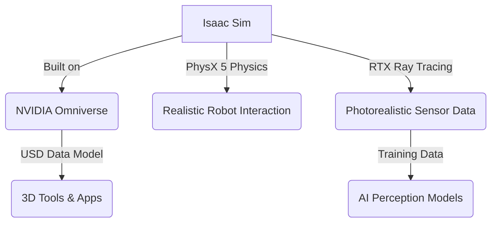

# Chapter 4: Advanced Robotics Platforms - NVIDIA Isaac

## Accelerating Physical AI with a Full Stack Approach

Welcome to the frontier of advanced robotics! In previous modules, you've mastered ROS 2 as the robotic nervous system and explored digital twins in Gazebo and Unity. Now, we ascend to a new level, diving into **NVIDIA Isaac**-a powerful, comprehensive platform designed to accelerate the development of AI-powered robots, especially humanoids. NVIDIA Isaac is not just a simulator; it's an entire ecosystem that bridges the gap between simulation, perception, and real-world deployment, all driven by GPU-accelerated computing.

As humanoid robots become more sophisticated, demanding hyper-realistic simulation, complex sensor processing, and advanced AI inference, specialized platforms like NVIDIA Isaac become indispensable. This module will equip you to leverage Isaac Sim (built on NVIDIA Omniverse) for highly realistic, scalable simulation, and to integrate your ROS 2 controllers within this high-performance environment. Prepare to unlock unparalleled acceleration for your physical AI projects.

<!-- Hero section with animated robot GIF placeholder for NVIDIA Isaac -->


---

## Learning Outcomes

Upon completing this module, you will be able to:

*   Describe the key components and advantages of the NVIDIA Isaac robotics platform.
*   Set up and navigate basic environments within NVIDIA Isaac Sim.
*   Integrate ROS 2 control nodes with simulated humanoid robots in Isaac Sim.
*   Understand the role of NVIDIA Omniverse in collaborative robotics development and synthetic data generation.
*   Perform basic tasks with a simulated humanoid robot using Isaac Sim's tools and APIs.

---

## The NVIDIA Isaac Ecosystem: A Full Stack for Robotics

NVIDIA Isaac is a modular platform built to simplify the development and deployment of robotics applications. It encompasses several key components:

*   **Isaac Sim**: A robotics simulation platform built on NVIDIA Omniverse, offering physically accurate, photorealistic environments for developing, testing, and managing AI-based robots.
*   **Isaac ROS**: A collection of ROS 2 packages that provide high-performance, GPU-accelerated modules for perception, navigation, and manipulation, optimized for NVIDIA hardware.
*   **Isaac SDK**: A software development kit providing tools and APIs for building robotic applications, including a rich library of perception and AI algorithms.
*   **NVIDIA Omniverse**: A platform for connecting and building 3D tools and applications. Isaac Sim runs within Omniverse, enabling collaborative workflows and seamless data exchange.

:::tip
**Key Differentiator**: NVIDIA Isaac's strength lies in its **GPU acceleration** across the entire stack-from simulation to perception algorithms-which is crucial for the demanding computational needs of advanced humanoids.
:::

---

## Mastering NVIDIA Isaac Sim: Simulation and Omniverse

Isaac Sim provides a powerful environment for robotics development that stands apart due to its integration with Omniverse.

### Isaac Sim: Physically Accurate and Photorealistic

Built on the NVIDIA Omniverse platform, Isaac Sim offers:

*   **USD (Universal Scene Description)**: Isaac Sim uses USD as its core data model, enabling interoperability and collaboration across different 3D tools.
*   **PhysX 5 Physics**: State-of-the-art physics engine for highly realistic rigid-body and soft-body dynamics, crucial for humanoid interaction with unstructured environments.
*   **RTX Real-time Ray Tracing**: Photorealistic rendering for accurate visual sensor simulation (e.g., cameras), vital for training computer vision models with synthetic data.
*   **Multi-Robot & Swarm Simulation**: Scalable simulation capabilities for testing complex multi-robot systems.


*Mermaid Diagram: NVIDIA Isaac Sim Ecosystem*

### Omniverse: The Collaboration Hub

NVIDIA Omniverse is more than just a renderer; it's a platform that allows different applications (like Isaac Sim, Blender, CAD tools) to connect and collaborate on 3D workflows. For robotics, this means:

*   **Live Collaboration**: Multiple users can work on the same simulation environment or robot model in real-time.
*   **Synthetic Data Generation**: Leverage the photorealism and control of Isaac Sim to generate vast amounts of high-quality, labeled synthetic data for AI training.
*   **Digital Twin Management**: Create and manage digital twins of physical robots and their environments, ensuring consistency between virtual and real systems.

:::danger
**Warning**: While incredibly powerful, Isaac Sim and Omniverse require significant GPU resources. Ensure your development machine meets NVIDIA's recommended specifications for optimal performance.
:::

---

## Hands-on Section 1: Launching Isaac Sim and a Basic Humanoid

Let's get started with Isaac Sim. This section assumes you have NVIDIA Omniverse Launcher and Isaac Sim installed.

### Launching Isaac Sim

1.  **Open Omniverse Launcher**: Start the NVIDIA Omniverse Launcher application.
2.  **Launch Isaac Sim**: From the Library or Exchange tab, launch NVIDIA Isaac Sim.

### Spawning a Basic Humanoid

Once Isaac Sim is open, you can interact with it via the UI or Python scripts. We'll use a simple Python script to spawn a pre-built humanoid.

```python
# physical-ai-humanoid-robotics-textbook/isaac_ws/spawn_humanoid.py

from omni.isaac.kit import SimulationApp

# Start Isaac Sim
simulation_app = SimulationApp({"headless": False})

from omni.isaac.core import World
from omni.isaac.core.robots import Robot
from omni.isaac.core.utils.nucleus import get_assets_root_path
import omni.isaac.core.utils.numpy as np_utils
import numpy as np
import carb

class HumanoidSpawner:
    def __init__(self):
        self.world = World(stage_units_in_meters=1.0)
        self.world.scene.add_default_ground_plane()
        self.assets_root_path = get_assets_root_path()
        if self.assets_root_path is None:
            carb.log_error("Could not find Isaac Sim Assets folder")
            simulation_app.close()
            exit()

        # Load a pre-built humanoid asset
        # --- Physical AI Relevance: Utilizing pre-built models accelerates development ---
        self.humanoid_asset_path = self.assets_root_path + "/Isaac/Robots/Humanoids/SMPL/smpl_humanoid_example.usd"

        self.humanoid = self.world.scene.add_default_ground_plane()

        # Add the humanoid robot to the scene
        self.humanoid = self.world.scene.add_robot(
            prim_path="/World/smpl_humanoid_example",
            name="smpl_humanoid",
            usd_path=self.humanoid_asset_path,
            position=np.array([0.0, 0.0, 1.0]), # Adjust starting height
            orientation=np_utils.euler_angles_to_quats(np.array([0, 0, 0]))
        )

        self.world.reset()

    def run_simulation(self):
        while simulation_app.is_running():
            self.world.step(render=True)
            if self.world.is_playing():
                if self.world.current_time_step_index == 0:
                    self.world.reset()

            # Example: Simple movement (adjust joint states)
            # joint_positions = self.humanoid.get_joint_positions()
            # joint_positions[0] += 0.01 # Move a joint
            # self.humanoid.set_joint_positions(joint_positions)


# Instantiate and run
spawner = HumanoidSpawner()
spawner.run_simulation()

simulation_app.close()
```
*Code Block: `spawn_humanoid.py` - Python script to spawn a humanoid in Isaac Sim.*

To run this script:

```bash
# Navigate to your Isaac Sim installation directory (where python.sh is located)
# e.g., cd ~/.local/share/ov/pkg/isaac_sim-2023.1.1/python.sh (adjust path)
cd /path/to/isaac-sim/python.sh

# Run the Python script (ensure you have activated the Isaac Sim environment)
./python.sh /path/to/your/isaac_ws/spawn_humanoid.py
```

:::info
**Expected Isaac Sim Output:**

Isaac Sim should launch, and you will see a basic humanoid robot model spawned in the default ground plane environment.

<!-- Placeholder for Isaac Sim humanoid screenshot -->


*Screenshot: A basic humanoid robot spawned in NVIDIA Isaac Sim.*
:::

---

## Hands-on Section 2: ROS 2 Control with Isaac Sim

Integrating ROS 2 with Isaac Sim allows you to use your existing ROS 2 controllers and tools within the high-fidelity simulation environment.

### Isaac Sim ROS 2 Bridge

Isaac Sim provides a native ROS 2 bridge. You typically enable it via the Isaac Sim UI (Window > ROS > ROS Bridge) or a Python script.

```python
# physical-ai-humanoid-robotics-textbook/isaac_ws/ros2_humanoid_control.py

from omni.isaac.kit import SimulationApp
simulation_app = SimulationApp({"headless": False})

from omni.isaac.core import World
from omni.isaac.core.robots import Robot
from omni.isaac.core.utils.nucleus import get_assets_root_path
import omni.isaac.core.utils.numpy as np_utils
import numpy as np
import carb

# Import ROS 2 specific components from Isaac Sim
from omni.isaac.ros2_bridge import ROS2Context
from omni.isaac.core.utils.types import ArticulationAction # For sending joint commands
import rclpy
from geometry_msgs.msg import Twist # For receiving velocity commands

class IsaacHumanoidController(Node):
    def __init__(self):
        super().__init__('isaac_humanoid_controller')
        self.world = World(stage_units_in_meters=1.0)
        self.world.scene.add_default_ground_plane()
        self.assets_root_path = get_assets_root_path()

        self.humanoid_asset_path = self.assets_root_path + "/Isaac/Robots/Humanoids/SMPL/smpl_humanoid_example.usd"
        selfn.humanoid = self.world.scene.add_robot(
            prim_path="/World/smpl_humanoid_example",
            name="smpl_humanoid",
            usd_path=self.humanoid_asset_path,
            position=np.array([0.0, 0.0, 1.0]),
            orientation=np_utils.euler_angles_to_quats(np.array([0, 0, 0]))
        )

        # Initialize ROS 2 context within Isaac Sim
        self.ros2_context = ROS2Context()
        self.ros2_context.initialize()

        # Create a ROS 2 subscriber for velocity commands (like our llm_agent_bridge would send)
        self.subscription = self.create_subscription(
            Twist,
            'cmd_vel',
            self.twist_callback,
            10
        )
        self.get_logger().info('Isaac Humanoid Controller Node has started. Subscribing to /cmd_vel...')

        # Store received velocity commands
        self.linear_vel = 0.0
        self.angular_vel = 0.0

        # Get joint prims to control (simplified for base movement)
        # --- Physical AI Relevance: Direct control of simulated joints ---
        self.joint_names = self.humanoid.get_joint_names()
        # Assuming a base joint for movement for simplicity, or directly apply force to base_link
        # For full humanoid, this would map to specific leg joints for walking

        self.world.reset()

    def twist_callback(self, msg):
        self.linear_vel = msg.linear.x
        self.angular_vel = msg.angular.z
        self.get_logger().info(f'Received Twist: Linear.x={self.linear_vel}, Angular.z={self.angular_vel}')

    def apply_movement(self):
        # This is a simplified way to apply movement. For a true humanoid, inverse kinematics
        # would map twist to joint angles.
        # For simplicity, we'll apply force/velocity to the base or a main joint.
        # self.humanoid.apply_velocity(np.array([self.linear_vel, 0.0, 0.0]),
        #                               np.array([0.0, 0.0, self.angular_vel]))
        pass # More complex movement logic would go here

def main():
    rclpy.init()
    controller_node = IsaacHumanoidController()

    # Isaac Sim simulation loop
    while simulation_app.is_running():
        controller_node.world.step(render=True)
        if controller_node.world.is_playing():
            controller_node.apply_movement() # Apply movement based on received ROS 2 commands
            rclpy.spin_once(controller_node, timeout_sec=0.001) # Process ROS 2 callbacks

    rclpy.shutdown()
    simulation_app.close()

if __name__ == '__main__':
    main()
```
*Code Block: `ros2_humanoid_control.py` - Isaac Sim script with ROS 2 subscriber for `Twist` commands.*

### Running the Integrated System

1.  **Run Isaac Sim Script**: Execute the `ros2_humanoid_control.py` script as shown previously for `spawn_humanoid.py`.
2.  **Run ROS 2 Publisher (from Module 1)**: In a separate terminal, run the `llm_agent_bridge` node from Module 1 (`ros2 run humanoid_arm_controller llm_agent_bridge`).
3.  **Publish Command**: Publish a `/llm_high_level_command` from a new terminal, which will trigger the `llm_agent_bridge` to publish `/cmd_vel` messages.

```bash
# Source ROS 2 setup (if not already in a ROS 2 terminal)
source ~/ros2_humanoid_ws/install/setup.bash

# Publish a high-level command (e.g., from Module 1's example)
ros2 topic pub /llm_high_level_command std_msgs/String "data: 'Please walk forward'" -1
```

:::info
**Expected Isaac Sim Console/ROS Output:**

In the Isaac Sim console, you should see messages indicating `Twist` commands being received. If you implement the movement logic in `apply_movement()`, your humanoid robot in Isaac Sim will respond to the ROS 2 commands.

<!-- Placeholder for Isaac Sim ROS 2 control screenshot -->


*Screenshot: Humanoid robot in Isaac Sim responding to ROS 2 commands.*
:::

---

## Common Pitfalls & Debugging Tips

*   **Isaac Sim Environment**: Ensure you're launching Python scripts correctly within the Isaac Sim Python environment (`./python.sh` from the install directory).
*   **ROS 2 Bridge Status**: Verify the ROS 2 bridge is active in Isaac Sim. Check its UI or logs for connection issues.
*   **USD Pathing**: Be meticulous with USD asset paths. Incorrect paths are a common source of errors for models not loading.
*   **Joint Control**: Humanoid control is complex. Start with simple joint position commands before attempting inverse kinematics or full locomotion.

:::success
**Tip**: Isaac Sim comes with extensive example scripts and tutorials. Always refer to these first when encountering new challenges or integrating complex features. ([https://docs.omniverse.nvidia.com/isaacsim/latest/tutorials.html](https://docs.omniverse.nvidia.com/isaacsim/latest/tutorials.html))
:::

---

## Quiz: Accelerate Your Robotic Prowess!

1.  **Multiple Choice**: Which NVIDIA technology forms the foundation for Isaac Sim, enabling collaborative 3D workflows and data exchange?
    a) CUDA
    b) cuDNN
    c) Omniverse
    d) TensorRT
    <details>
      <summary>Answer</summary>
      **c) Omniverse**
    </details>

2.  **Code Completion**: In Isaac Sim Python scripting, you would typically import `SimulationApp` from `omni.isaac.kit`. To add a robot to your world, you would use `self.world.scene.add_robot(_____)`.

    <details>
      <summary>Answer</summary>
      `prim_path="/World/robot_name", name="robot_name", usd_path=asset_path, ...`
    </details>

3.  **Multiple Choice**: What is a primary advantage of Isaac Sim's RTX Real-time Ray Tracing for AI perception models?
    a) It simplifies the physical cabling for real robots
    b) It allows for photorealistic sensor data generation for training
    c) It eliminates the need for any physics engine
    d) It enables direct human teleoperation of simulated robots
    <details>
      <summary>Answer</summary>
      **b) It allows for photorealistic sensor data generation for training**
    </details>

4.  **Code Completion**: To initialize the ROS 2 context within an Isaac Sim Python script for bridging, you would typically call `self.ros2_context._____()` after creating the `ROS2Context` object.

    <details>
      <summary>Answer</summary>
      `initialize`
    </details>

5.  **Multiple Choice**: What is the purpose of `USD (Universal Scene Description)` in the NVIDIA Isaac ecosystem?
    a) A programming language for robotics control
    b) A database for storing robot sensor data
    c) A file format for describing 3D scenes and assets
    d) A communication protocol for ROS 2 nodes
    <details>
      <summary>Answer</summary>
      **c) A file format for describing 3D scenes and assets**
    </details>

---

## Further Reading & Official Resources (2025 Links)

*   **NVIDIA Isaac Sim Documentation**: The comprehensive guide for Isaac Sim. ([https://docs.omniverse.nvidia.com/isaacsim/latest/index.html](https://docs.omniverse.nvidia.com/isaacsim/latest/index.html))
*   **NVIDIA Omniverse Documentation**: Learn more about the underlying Omniverse platform. ([https://docs.omniverse.nvidia.com/](https://docs.omniverse.nvidia.com/))
*   **Isaac ROS Documentation**: Explore GPU-accelerated ROS 2 packages. ([https://developer.nvidia.com/isaac-ros](https://developer.nvidia.com/isaac-ros))
*   **USD Overview**: Understand the Universal Scene Description format. ([https://graphics.pixar.com/usd/docs/index.html](https://graphics.pixar.com/usd/docs/index.html))
*   **Isaac Sim ROS 2 Tutorials**: Specific tutorials for integrating ROS 2 with Isaac Sim. ([https://docs.omniverse.nvidia.com/isaacsim/latest/ros_tutorials.html](https://docs.omniverse.nvidia.com/isaacsim/latest/ros_tutorials.html))

---

## Summary and Transition to Module 4

In this module, you've been introduced to the powerful NVIDIA Isaac ecosystem, mastering Isaac Sim for physically accurate and photorealistic simulation, and understanding how Omniverse facilitates collaborative, data-rich robotics development. You've also learned to integrate ROS 2 control with Isaac Sim environments, taking a significant step towards leveraging GPU-accelerated computing for physical AI.

The ability to simulate complex humanoid robots with high fidelity and at scale is a game-changer for AI training and rapid prototyping. NVIDIA Isaac provides the tools to push the boundaries of what's possible, bridging the gap between virtual intelligence and physical embodiment.

With a strong grasp of ROS 2, advanced simulation, and accelerated platforms, you are now ready to delve into the cutting edge of robot intelligence: Vision-Language-Action (VLA) systems. The next module will explore how multimodal AI models empower humanoids to understand, reason, and act in the real world based on diverse sensory input.

Ready to integrate perception, language, and action?
