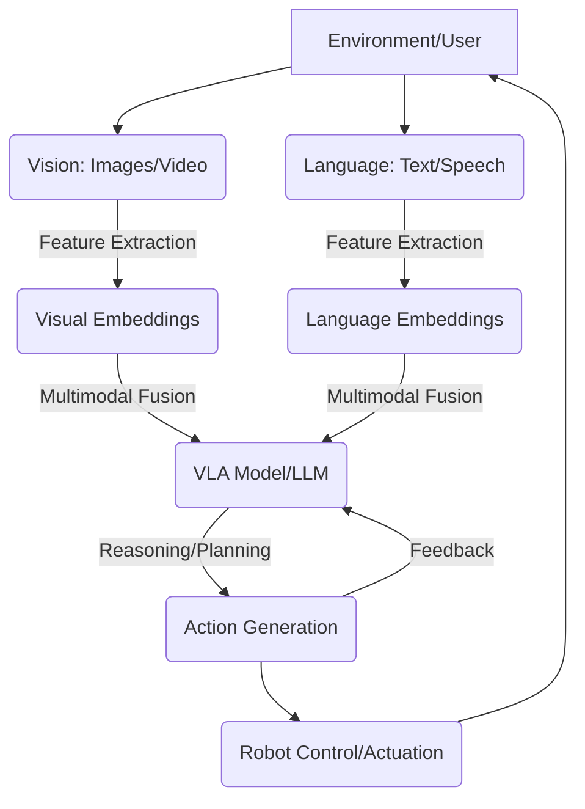

# Chapter 5: Vision-Language-Action (VLA) Systems - Foundations

## Bridging Perception, Cognition, and Embodiment

Welcome to the cutting edge of Physical AI! In previous modules, you've mastered the robotic nervous system with ROS 2, built intricate digital twins in Gazebo and Unity, and explored advanced platforms like NVIDIA Isaac. Now, we're ready to integrate the very essence of human-like intelligence into our humanoids: **Vision-Language-Action (VLA) Systems**.

VLA systems are the next frontier, enabling robots to perceive their surroundings through vision, comprehend instructions and context through language, and execute physical actions in response. Imagine a humanoid robot that can "see" a messy room, "understand" the command "please tidy up," and then "act" to sort objects. This module will lay the foundational knowledge for building such multimodal AI capabilities, transforming our robots from mere automatons into truly intelligent and interactive agents.

<!-- Hero section with animated robot GIF placeholder for VLA system -->


---

## Learning Outcomes

Upon completing this chapter, you will be able to:

*   Describe the conceptual architecture of Vision-Language-Action systems in the context of humanoid robotics.
*   Identify and explain the roles of key AI models for perception (vision), cognition (language), and control (action).
*   Understand how multimodal sensor data (visual, auditory) is processed and integrated into VLA pipelines.
*   Implement simple VLA-inspired behaviors for a simulated humanoid robot using Python and ROS 2.
*   Discuss the challenges and ethical implications of deploying VLA systems in real-world human-robot interaction.

---

## The VLA Paradigm: Perceive, Comprehend, Act

At its core, a Vision-Language-Action system empowers a robot to engage with its environment in a human-like manner. This involves three tightly coupled components:

1.  **Vision (Perception)**: The ability to interpret visual information from cameras, understanding objects, their properties, spatial relationships, and environmental context. This often leverages advanced computer vision models.
2.  **Language (Cognition)**: The ability to process and generate natural language. This includes understanding spoken or written commands, queries, and descriptions, and formulating verbal responses or internal plans. Large Language Models (LLMs) are central here.
3.  **Action (Embodiment)**: The ability to translate cognitive understanding into physical movements and manipulations, often involving complex motor control, planning, and execution within the robot's physical constraints.

Together, these components create a feedback loop, allowing the robot to continuously observe, reason, and act.


*Mermaid Diagram: Conceptual Flow of a Vision-Language-Action (VLA) System*

---

## Key AI Models for VLA

The power of VLA systems comes from the integration of various specialized AI models.

### Visual Perception: Beyond Object Detection

While basic object detection (e.g., YOLO, Faster R-CNN) is a starting point, VLA systems demand deeper visual understanding:

*   **Instance Segmentation**: Identifying individual instances of objects and their precise boundaries (e.g., Mask R-CNN).
*   **Semantic Segmentation**: Classifying each pixel in an image to a semantic class (e.g., "floor," "wall," "chair").
*   **Scene Understanding**: Interpreting the overall context, affordances (what actions are possible with objects), and relationships between entities in a scene.
*   **Vision Transformers (ViT)**: Models like ViT have revolutionized vision tasks by applying transformer architectures, initially popular in NLP, to image data.

**Physical AI Relevance**: Accurate visual perception is critical for humanoids to navigate cluttered environments, manipulate diverse objects, and understand human gestures.

### Natural Language Understanding & Generation: The LLM Core

Large Language Models (LLMs) form the cognitive backbone of VLA systems. They enable:

*   **Command Following**: Interpreting complex, nuanced instructions (e.g., "Pick up the red mug on the table next to the laptop").
*   **Question Answering**: Providing contextually relevant answers about the environment or ongoing tasks.
*   **Dialog Management**: Engaging in natural conversations, clarifying ambiguities, and confirming actions.
*   **Reasoning & Planning**: Translating high-level goals into a sequence of executable sub-goals or actions.

**Physical AI Relevance**: LLMs allow humanoids to interact intuitively with humans, understand abstract goals, and perform complex tasks without explicit programming for every scenario.

### Action Generation: From High-Level to Low-Level Control

This is where the robot's physical embodiment comes into play, converting cognitive decisions into motor commands:

*   **Task Planning**: Decomposing a high-level instruction (e.g., "make coffee") into a series of smaller, feasible steps (e.g., "go to counter," "pick up mug," "fill water").
*   **Motion Planning**: Generating smooth, collision-free trajectories for the robot's end-effectors or base (e.g., using sampling-based planners like RRT* or optimization-based methods).
*   **Inverse Kinematics (IK)**: Calculating the joint angles required to achieve a desired end-effector pose.
*   **Reinforcement Learning (RL)**: Training policies to directly map observations to actions, especially useful for complex, dynamic, or highly dexterous tasks.

**Physical AI Relevance**: Effective action generation ensures the humanoid can safely and efficiently execute tasks in the real world, adapting to unforeseen circumstances.

---

## Hands-on Section 1: Integrating Vision and Language for Basic Command

Let's simulate a basic VLA interaction. Our humanoid will "see" an object (represented as a simulated visual input) and "understand" a verbal command to move towards it. We'll use a simplified Python script that combines a dummy vision system with a text-based command interpreter.

### Scenario: Move to Object

The robot will receive a command like "move to the red block". Our script will:
1.  Parse the command to identify the object and action.
2.  Simulate "seeing" the object's position.
3.  Generate a simple movement command.

```python
# physical-ai-humanoid-robotics-textbook/vla_ws/src/vla_agent/scripts/basic_vla_agent.py

import rclpy
from rclpy.node import Node
from std_msgs.msg import String
from geometry_msgs.msg import Twist
import json # For simulating complex vision input

class BasicVLAAgent(Node):
    def __init__(self):
        super().__init__('basic_vla_agent')
        self.publisher_ = self.create_publisher(Twist, 'cmd_vel', 10)
        self.subscription = self.create_subscription(
            String,
            'llm_high_level_command', # Simulate LLM agent providing high-level commands
            self.command_callback,
            10)
        self.subscription # prevent unused variable warning

        self.get_logger().info('Basic VLA Agent Node has started. Waiting for commands...')

        # --- Physical AI Relevance: Simulating perceived objects and their properties ---
        # In a real system, this would come from a complex vision pipeline
        self.simulated_objects = {
            "red block": {"x": 1.0, "y": 0.5, "z": 0.0, "color": "red", "shape": "block"},
            "blue sphere": {"x": -0.8, "y": 1.2, "z": 0.0, "color": "blue", "shape": "sphere"},
            "green box": {"x": 0.0, "y": -1.5, "z": 0.0, "color": "green", "shape": "box"}
        }

    def command_callback(self, msg):
        high_level_command = msg.data.lower()
        self.get_logger().info(f'Received high-level command: "{high_level_command}"')

        twist_msg = Twist()
        target_object_found = False

        if "move to" in high_level_command:
            # Simple language parsing: extract object name
            parts = high_level_command.split("move to ")
            if len(parts) > 1:
                object_name_candidate = parts[1].strip()

                # --- Physical AI Relevance: Bridging language understanding with visual perception ---
                # Look up the object in our simulated vision
                if object_name_candidate in self.simulated_objects:
                    target_object = self.simulated_objects[object_name_candidate]
                    self.get_logger().info(f"Found '{object_name_candidate}' at {target_object['x']},{target_object['y']}")

                    # Simple action generation: move towards the object
                    # For a real robot, this would involve path planning, inverse kinematics, etc.
                    # Here, we'll just set linear velocity in x based on distance (simplified)
                    # And angular velocity in z if it's not directly in front
                    distance_x = target_object['x']
                    distance_y = target_object['y']

                    # Simplified P-controller for movement
                    kp_linear = 0.5
                    kp_angular = 1.0

                    twist_msg.linear.x = kp_linear * distance_x
                    twist_msg.angular.z = kp_angular * distance_y # Aim to reduce lateral error

                    self.get_logger().info(f"Publishing Twist: linear.x={twist_msg.linear.x}, angular.z={twist_msg.angular.z}")
                    self.publisher_.publish(twist_msg)
                    target_object_found = True
                else:
                    self.get_logger().warn(f"Object '{object_name_candidate}' not found in simulated vision.")

        if not target_object_found:
            self.get_logger().warn("Could not parse command or find target object. Publishing zero Twist.")
            self.publisher_.publish(Twist()) # Stop the robot if command is unclear

def main(args=None):
    rclpy.init(args=args)
    vla_agent = BasicVLAAgent()
    rclpy.spin(vla_agent) # Keep the node alive and listening
    vla_agent.destroy_node()
    rclpy.shutdown()

if __name__ == '__main__':
    main()
```
*Code Block: `basic_vla_agent.py` - Basic VLA agent for simulated vision-language command.*

### Create ROS 2 Package and Setup

We need to create a ROS 2 package for our VLA agent.

```bash
# Navigate to your ROS 2 workspace src directory
# e.g., cd ~/ros2_humanoid_ws/src
mkdir -p physical-ai-humanoid-robotics-textbook/ros2_ws/src/vla_agent
cd physical-ai-humanoid-robotics-textbook/ros2_ws/src/vla_agent

# Create a new ROS 2 Python package
ros2 pkg create --build-type ament_python vla_agent --dependencies rclpy std_msgs geometry_msgs

# Move the Python script into the scripts directory
mkdir scripts
mv ../../../vla_ws/src/vla_agent/scripts/basic_vla_agent.py scripts/

# Open and edit setup.py in vla_agent
# Add 'scripts/basic_vla_agent.py' to entry_points console_scripts
# For setup.py located at physical-ai-humanoid-robotics-textbook/ros2_ws/src/vla_agent/setup.py
```
*Code Block: ROS 2 Package Creation Steps*

### Modify `setup.py`

You need to edit `physical-ai-humanoid-robotics-textbook/ros2_ws/src/vla_agent/setup.py` to include the `basic_vla_agent.py` script as an executable entry point.

```python
# physical-ai-humanoid-robotics-textbook/ros2_ws/src/vla_agent/setup.py (excerpt)
from setuptools import find_packages, setup

package_name = 'vla_agent'

setup(
    name=package_name,
    version='0.0.0',
    packages=find_packages(exclude=['test']),
    data_files=[
        ('share/' + package_name, ['package.xml']),
        ('share/' + package_name + '/launch', ['launch/vla_launch.py']), # Example launch file
    ],
    install_requires=['setuptools'],
    zip_safe=True,
    maintainer='your_name',
    maintainer_email='your_email@example.com',
    description='TODO: Package description',
    license='TODO: License declaration',
    tests_require=['pytest'],
    entry_points={
        'console_scripts': [
            'basic_vla_agent = vla_agent.scripts.basic_vla_agent:main', # Add this line
        ],
    },
)
```
*Code Block: `setup.py` - Adding the `basic_vla_agent` entry point.*

### Running the VLA Agent and Publishing Commands

1.  **Build your ROS 2 workspace**:
    ```bash
    # Navigate to your ROS 2 workspace root
    cd ~/physical-ai-humanoid-robotics-textbook/ros2_ws
    colcon build
    source install/setup.bash
    ```

2.  **Run the `basic_vla_agent` node**:
    ```bash
    ros2 run vla_agent basic_vla_agent
    ```

3.  **In a new terminal, publish a command**:
    ```bash
    # Source ROS 2 setup if not already done
    cd ~/physical-ai-humanoid-robotics-textbook/ros2_ws
    source install/setup.bash

    ros2 topic pub /llm_high_level_command std_msgs/String "data: 'move to the red block'" -1
    ```

:::info
**Expected Terminal Output (from `basic_vla_agent` node):**

```
[INFO] [basic_vla_agent]: Basic VLA Agent Node has started. Waiting for commands...
[INFO] [basic_vla_agent]: Received high-level command: "move to the red block"
[INFO] [basic_vla_agent]: Found 'red block' at 1.0,0.5
[INFO] [basic_vla_agent]: Publishing Twist: linear.x=0.5, angular.z=0.5
```
*(You should see the agent processing the command and publishing a `Twist` message.)*
:::

---

## Hands-on Section 2: Beyond Basic - Vision-Language Navigation

A more advanced VLA task is Vision-Language Navigation (VLN), where a robot must navigate an environment based on natural language instructions (e.g., "Go past the kitchen, turn left at the couch, and stop in front of the TV"). This requires:

*   **Environmental Embodiment**: The robot needs to be situated in a simulated (or real) environment with visual sensors.
*   **Instruction Following Models**: Deep learning models that can map natural language instructions to navigation actions.
*   **Path Planning**: Generating a navigable path in the environment.

### Example: Simulated VLN Framework

While a full VLN implementation is beyond a single chapter, we can outline the key components and a conceptual Python structure.

```python
# physical-ai-humanoid-robotics-textbook/vla_ws/src/vln_agent/scripts/vln_navigator.py

import rclpy
from rclpy.node import Node
from sensor_msgs.msg import Image # For visual input
from std_msgs.msg import String # For language instructions and status
from geometry_msgs.msg import Twist # For navigation commands
from cv_bridge import CvBridge # To convert ROS Image to OpenCV image

# --- Physical AI Relevance: Placeholder for advanced VLA models ---
# In a real VLN system, this would be a sophisticated deep learning model
# like VLN-BERT, Room-Across-Room, etc.
class VLNModel:
    def __init__(self):
        self.get_logger_ref = None # Will be set by the node
        self.current_instruction = ""
        self.navigation_state = "IDLE"
        self.path_history = []

    def process_multimodal_input(self, image_data, instruction):
        # This is where a complex VLA model would perform:
        # 1. Feature extraction from image (CNN, ViT)
        # 2. Feature extraction from instruction (BERT, Transformer)
        # 3. Multimodal fusion
        # 4. Reasoning to generate a sub-goal or action sequence

        if self.get_logger_ref:
            self.get_logger_ref().info(f"VLN Model: Processing instruction '{instruction}' with image data.")
            # Simplified logic: if instruction changes, reset state
            if instruction != self.current_instruction:
                self.current_instruction = instruction
                self.navigation_state = "NAVIGATING"
                self.path_history = []
                self.get_logger_ref().info(f"VLN Model: New instruction received. Starting navigation for: {instruction}")

        # Simulate generating a Twist command
        # In reality, this would be derived from path planning and current visual cues
        twist = Twist()
        if self.navigation_state == "NAVIGATING":
            if "turn left" in instruction:
                twist.angular.z = 0.5
                self.path_history.append("turn left")
            elif "go forward" in instruction:
                twist.linear.x = 0.2
                self.path_history.append("go forward")
            elif "stop" in instruction:
                self.navigation_state = "COMPLETED"
                if self.get_logger_ref:
                    self.get_logger_ref().info("VLN Model: Navigation completed.")
        return twist, self.navigation_state

class VLNNavigator(Node):
    def __init__(self):
        super().__init__('vln_navigator')
        self.cmd_vel_publisher = self.create_publisher(Twist, 'cmd_vel', 10)
        self.status_publisher = self.create_publisher(String, 'vln_status', 10)

        self.image_subscription = self.create_subscription(
            Image,
            '/humanoid/camera/color/image_raw', # Assuming camera topic from Module 3
            self.image_callback,
            10)
        self.language_subscription = self.create_subscription(
            String,
            'llm_navigation_instruction', # High-level navigation instruction
            self.language_callback,
            10)

        self.bridge = CvBridge()
        self.vln_model = VLNModel()
        self.vln_model.get_logger_ref = self.get_logger # Pass logger to the model

        self.current_image = None
        self.current_instruction = ""

        self.timer = self.create_timer(0.1, self.navigation_loop) # Run navigation logic periodically

        self.get_logger().info('VLN Navigator Node has started. Waiting for image and language inputs...')

    def image_callback(self, msg):
        try:
            # --- Physical AI Relevance: Processing real-time visual data ---
            # Convert ROS Image message to OpenCV image
            self.current_image = self.bridge.imgmsg_to_cv2(msg, "bgr8")
            # self.get_logger().info("Received image data.")
        except CvBridgeError as e:
            self.get_logger().error(f"CvBridge Error: {e}")

    def language_callback(self, msg):
        self.current_instruction = msg.data
        self.get_logger().info(f"Received navigation instruction: '{self.current_instruction}'")

    def navigation_loop(self):
        if self.current_image is not None and self.current_instruction != "":
            # Process inputs through the (simplified) VLN model
            twist_command, nav_status = self.vln_model.process_multimodal_input(self.current_image, self.current_instruction)

            self.cmd_vel_publisher.publish(twist_command)

            status_msg = String()
            status_msg.data = f"Status: {nav_status}, Current Instruction: {self.current_instruction}"
            self.status_publisher.publish(status_msg)

            if nav_status == "COMPLETED":
                self.get_logger().info("VLN task completed. Resetting instruction.")
                self.current_instruction = "" # Reset for next command
        elif self.current_instruction == "":
            # Publish zero twist if no instruction
            self.cmd_vel_publisher.publish(Twist())

def main(args=None):
    rclpy.init(args=args)
    vln_navigator = VLNNavigator()
    rclpy.spin(vln_navigator)
    vln_navigator.destroy_node()
    rclpy.shutdown()

if __name__ == '__main__':
    main()
```
*Code Block: `vln_navigator.py` - Conceptual VLN agent for multimodal navigation.*

### Create ROS 2 Package for VLN

Similar to the previous example, create a new ROS 2 package for the VLN agent.

```bash
# Navigate to your ROS 2 workspace src directory
# e.g., cd ~/physical-ai-humanoid-robotics-textbook/ros2_ws/src
mkdir -p physical-ai-humanoid-robotics-textbook/ros2_ws/src/vln_agent
cd physical-ai-humanoid-robotics-textbook/ros2_ws/src/vln_agent

# Create a new ROS 2 Python package
ros2 pkg create --build-type ament_python vln_agent --dependencies rclpy sensor_msgs std_msgs geometry_msgs cv_bridge

# Move the Python script into the scripts directory
mkdir scripts
mv ../../../vla_ws/src/vln_agent/scripts/vln_navigator.py scripts/

# Open and edit setup.py in vln_agent
# Add 'scripts/vln_navigator.py' to entry_points console_scripts
# For setup.py located at physical-ai-humanoid-robotics-textbook/ros2_ws/src/vln_agent/setup.py
```
*Code Block: ROS 2 VLN Package Creation Steps*

### Modify `vln_agent/setup.py`

You need to edit `physical-ai-humanoid-robotics-textbook/ros2_ws/src/vln_agent/setup.py` to include the `vln_navigator.py` script as an executable entry point.

```python
# physical-ai-humanoid-robotics-textbook/ros2_ws/src/vln_agent/setup.py (excerpt)
from setuptools import find_packages, setup

package_name = 'vln_agent'

setup(
    name=package_name,
    version='0.0.0',
    packages=find_packages(exclude=['test']),
    data_files=[
        ('share/' + package_name, ['package.xml']),
    ],
    install_requires=['setuptools'],
    zip_safe=True,
    maintainer='your_name',
    maintainer_email='your_email@example.com',
    description='TODO: Package description',
    license='TODO: License declaration',
    tests_require=['pytest'],
    entry_points={
        'console_scripts': [
            'vln_navigator = vln_agent.scripts.vln_navigator:main', # Add this line
        ],
    },
)
```
*Code Block: `setup.py` - Adding the `vln_navigator` entry point.*

### Running the VLN Navigator (Conceptual)

To truly run this, you would need:
1.  A Gazebo/Isaac Sim environment publishing `/humanoid/camera/color/image_raw`.
2.  A separate node publishing `llm_navigation_instruction` (e.g., from a simulated LLM agent).

```bash
# Build your ROS 2 workspace
cd ~/physical-ai-humanoid-robotics-textbook/ros2_ws
colcon build
source install/setup.bash

# Run your VLN Navigator node
ros2 run vln_agent vln_navigator

# In separate terminals, simulate inputs
# Start Gazebo with humanoid and camera (from Module 3)
# ros2 launch humanoid_arm_controller display_in_gazebo.launch.py

# Publish a navigation instruction
# ros2 topic pub /llm_navigation_instruction std_msgs/String "data: 'go forward then turn left'" -1
```

:::warning
**Warning**: The `vln_navigator.py` script is conceptual. It requires an active ROS 2 image topic and a language instruction publisher to function meaningfully. The movement logic is highly simplified.
:::

---

## Common Pitfalls & Debugging Tips

*   **Multimodal Data Synchronization**: Ensuring that visual and language inputs are processed in a timely and synchronized manner is crucial. Use ROS 2 message filters if necessary.
*   **Action Space Definition**: Translating abstract language commands into concrete robot actions requires a carefully defined action space and robust motion planning.
*   **Computational Resources**: VLA models, especially LLMs and vision transformers, are computationally intensive. Optimize model size or use specialized hardware (GPUs, NPUs).
*   **Sim-to-Real Gap**: Behaviors learned in simulation may not directly transfer to the real world. Techniques like domain randomization and sim-to-real transfer learning are essential.
*   **Safety and Robustness**: VLA systems must be robust to ambiguity, errors, and unexpected events to operate safely in human environments.

:::danger
**Critical Security Concern**: When integrating LLMs into VLA systems, guard against prompt injection attacks. Malicious instructions could lead to unintended or harmful physical actions. Implement strict sanitization and safety overrides.
:::

---

## Quiz: Vision-Language-Action Systems

1.  **Multiple Choice**: Which component of a VLA system is primarily responsible for interpreting natural language commands from a human?
    a) Vision Module
    b) Language Module
    c) Action Module
    d) Motor Controller
    <details>
      <summary>Answer</summary>
      **b) Language Module**
    </details>

2.  **Code Completion**: To convert a ROS `sensor_msgs/Image` message into an OpenCV image in Python, you would typically use the `CvBridge` class and its `imgmsg_to_cv2(msg, "bgr8")` method. For example: `image_cv = self.bridge._____`
    <details>
      <summary>Answer</summary>
      `imgmsg_to_cv2(msg, "bgr8")`
    </details>

3.  **Multiple Choice**: What is a key challenge in deploying VLA systems from simulation to real-world humanoid robots?
    a) Difficulty in generating basic `Twist` messages
    b) The "sim-to-real gap" where simulated behaviors don't transfer well
    c) Lack of computational power in modern GPUs
    d) Inability to define ROS 2 topics for images
    <details>
      <summary>Answer</summary>
      **b) The "sim-to-real gap" where simulated behaviors don't transfer well**
    </details>

4.  **Code Completion**: In a ROS 2 Python node for a VLA agent, to receive high-level string commands from an LLM, you would create a `Subscriber` to a topic like `llm_high_level_command` with the message type `std_msgs.msg._____`
    <details>
      <summary>Answer</summary>
      `String`
    </details>

5.  **Multiple Choice**: Why is prompt injection a critical security concern for LLM-integrated VLA systems in physical robots?
    a) It can cause the robot to crash its software unexpectedly.
    b) It allows unauthorized access to the robot's internal sensor data.
    c) Malicious instructions could lead to unintended or harmful physical actions by the robot.
    d) It degrades the robot's visual perception capabilities.
    <details>
      <summary>Answer</summary>
      **c) Malicious instructions could lead to unintended or harmful physical actions by the robot.**
    </details>

---

## Further Reading & Official Resources (2025 Links)

*   **ROS 2 and Computer Vision**: Tutorials on integrating cameras and image processing with ROS 2. ([https://docs.ros.org/en/humble/Tutorials/Intermediate/Tf2/Introduction-To-Tf2.html](https://docs.ros.org/en/humble/Tutorials/Intermediate/Tf2/Introduction-To-Tf2.html) and search for image processing/computer vision on docs.ros.org)
*   **Large Language Models in Robotics**: Research papers and surveys on applying LLMs for robotic control and reasoning. ([https://openai.com/research/language-models-are-few-shot-learners](https://openai.com/research/language-models-are-few-shot-learners) and search for "LLMs robotics" on arXiv.org or Google Scholar)
*   **Vision-Language Navigation Benchmarks**: Explore common datasets and tasks for VLN. ([https://eval.ai/web/challenges/challenge-page/979/overview](https://eval.ai/web/challenges/challenge-page/979/overview) and search for "Vision-Language Navigation" benchmarks)
*   **Robotics Reinforcement Learning**: Resources on using RL for complex motor control and task execution in robots. ([https://www.deepmind.com/research/open-source/rl](https://www.deepmind.com/research/open-source/rl) and search for "robotics reinforcement learning tutorials")
*   **AI Safety Research**: Latest on ethical AI and safety in advanced AI systems. ([https://www.anthropic.com/research](https://www.anthropic.com/research) or other AI safety organizations)

---

## Summary and Transition to Chapter 10

In this foundational chapter, you've journeyed into the exciting world of Vision-Language-Action (VLA) systems. We've dissected the core components of multimodal AI, integrating vision for perception, language for cognition, and action for physical embodiment. You've seen conceptual implementations for basic command following and explored the complexities of Vision-Language Navigation.

Understanding how to bridge these distinct AI modalities is paramount for developing truly intelligent and interactive humanoid robots. The ability to interpret human intent, perceive the environment, and execute tasks autonomously marks a significant leap towards generalized physical AI.

As we move forward, the next chapter will delve deeper into advanced VLA architectures, exploring topics like embodied AI, fine-tuning LLMs for robotics, and real-world deployment challenges.

Ready to build smarter, more interactive humanoids?
